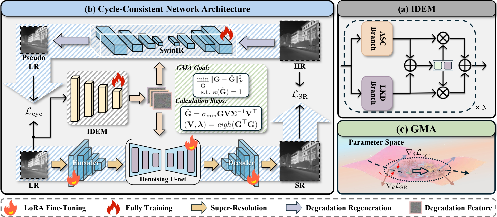
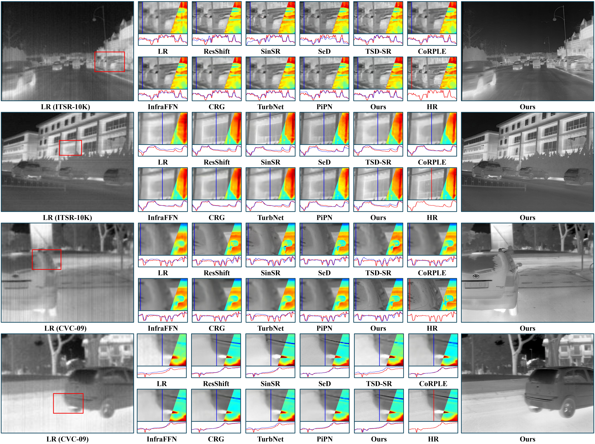
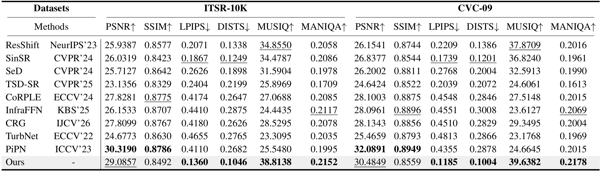

# TAD-IISR: Turbulence-Aware Diffusion for Infrared Image Super-Resolution

## Updates 

[2026-3-26] Our inference code and data is now available.

## Abstract
> Infrared imaging provides information complementary to visible light in adverse environments but is often severely degraded by atmospheric turbulence, sensor noise, and limited spatial resolution. Existing infrared image super-resolution (IISR) and turbulence mitigation (TM) methods overlook complex degradation coupling or rely on multi-frame information, limiting single-frame applicability. Directly cascading turbulence mitigation and super-resolution leads to error accumulation and detail loss due to strong degradation-resolution entanglement. To address these challenges, we propose TAD-IISR, a Turbulence-Aware Diffusion for Infrared Image Super-Resolution. TAD-IISR incorporates infrared degradation priors into a Low-Rank Adaptation module, dynamically adjusting parameters based on low-resolution (LR) input features to guide high-resolution (HR) restoration. Specifically, TAD-IISR introduces an Infrared Degradation Extraction Module (IDEM) within a Cycle-Consistent Network Architecture, leveraging bidirectional reconstruction (LR to HR and HR to LR) to ensure IDEM effectively disentangles degradation information. To stabilize optimization, TAD-IISR employs Gradient Matrix Alignment to alleviate gradient conflicts and gradient dominance problems between super-resolution and degradation tasks. To facilitate research, we construct ITSR-10K, a large-scale multi-scene dataset comprising 10,000 pairs of synthetic degraded and ground-truth infrared images derived from existing infrared image datasets. Extensive experiments demonstrate that TAD-IISR achieves state-of-the-art performance.

## Framework Overview

Overview of the proposed TAD-IISR framework. (b) The Cycle-Consistent Network Architecture employs a bidirectional training strategy (Super-Resolution and Degradation Regeneration) to enforce the (a) Infrared Degradation Extraction Module (IDEM) to explicitly disentangle degradation features. These features are injected into the diffusion model via LoRA layers to guide restoration. (c) Gradient Matrix Alignment (GMA) is introduced to mitigate gradient conflicts and dominance between the dual tasks during optimization.

## Visual Comparison


## Quantitative Comparison


## Dataset
We collected 10,000 infrared images from the CVC-09, FLIR, LLVIP, M<sup>3</sup>FD, and SMOD datasets and constructed their corresponding low-resolution counterparts. The dataset can be downloaded from [](https://drive.google.com/file/d/1PBGHtSexnl7VjUCD7HDjUcAMQVCqljA0/view?usp=sharing).


## Dependencies


```
git clone https://github.com/JZD151/TAD-IISR.git
cd TAD-IISR

conda create -n TAD-IISR python=3.12
conda activate TAD-IISR
pip install -r requirements.txt
pip install -e.
```

## Testing
> **Note:** We provide several sample inputs for easy inference.
1. Download the pretrained model [SD-Turbo](https://huggingface.co/stabilityai/sd-turbo) and [TAD-IISR](https://drive.google.com/file/d/1gEg9Xx0I5DAA_CeCk0ywe0oIXC7TI4Hn/view?usp=sharing), and place TAD-IISR in the ./output/checkpoints directory.

2. Modify the path in `configs/sr_test.yaml` to the absolute path of `testset/LR`.

3. Modify the `sd_path` parameter in both `run_inference.sh` and `run_inference_sr_only.sh` to the path of the downloaded SD-Turbo.

4. If you only want to perform super-resolution on the LR image, you can run the following command:

   ```
   sh run_inference_sr_only.sh
   ```
5. If you perform super-resolution and re-degradation at the same time, you can run the following command:

   ```
   sh run_inference.sh
   ```
## Evaluation
1. We provided the inferred images, and you can execute this command to evaluate the images:

   ```
   python evaluate.py
   ```

   
